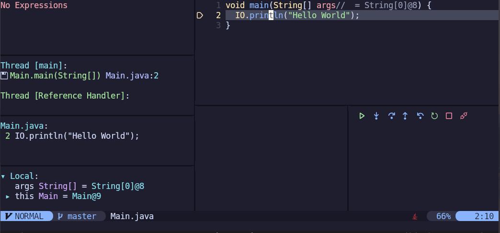
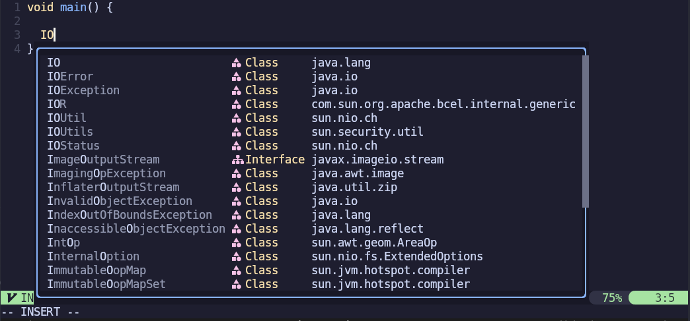
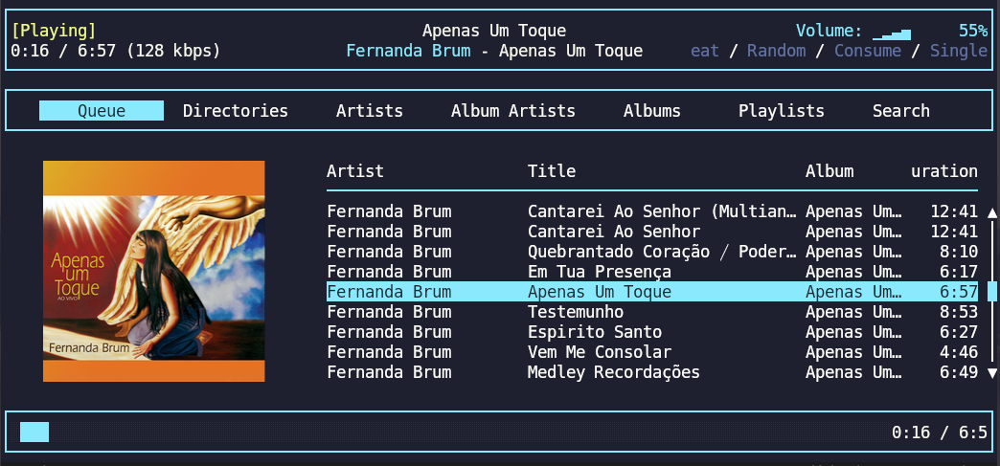

# Dotfiles & Configurations

This repository contains my personal configuration files (`dotfiles`) and utilities tools.

---

## 📁 Repository Structure

```text
.
├── config                   # Application-specific configuration files
├── dosbox                   # DOSBox emulator configuration
├── images                   # Example screenshots
├── initrc                   # Main initialization script
├── scripts                  # Custom scripts and utilities
├── sources                  # Sources for aliases, functions, and path helpers
├── tests                    # Automated tests for functions
├── tmux                     # Tmux plugins and themes
└── tmux.conf                # Main tmux configuration
```

---

## 🖼 Screenshots

### Neovim Debug Adapter Protocol (DAP)



### Neovim Language Server Protocol (LSP)



### RMPC Music Player



---

## ⚙️ Installation / Usage

1. Clone the repository:

```bash
git clone https://github.com/vmssilva/dotfiles.git
cd dotfiles
```

2. Set the `DOTFILES` environment variable:

```bash
export DOTFILES="$HOME/dotfiles"
```

3. Source your initialization script in your shell (`.bashrc` / `.zshrc`):

```bash
source "$DOTFILES/initrc"
```

---

## 🧰 Directory Highlights

* **`config/nvim`** – Neovim settings including `init.lua`, user config and Lua modules.
* **`config/kitty`** – Terminal themes and settings.
* **`config/mpd`** – Music database, state, and `mpd.conf`.
* **`config/rmpc`** – MPD client settings and themes.
* **`scripts/`** – Custom shell scripts.
* **`sources/aliases`** – Shell aliases organized by category.
* **`sources/functions`** – Reusable shell functions and helpers.
* **`tmux/`** – Tmux plugins and pre-configured themes for easy switching.

---

## 📌 Notes

* Requires **Lua** for the `doc.lua` documentation script.


* Tested on **Linux** systems only.
